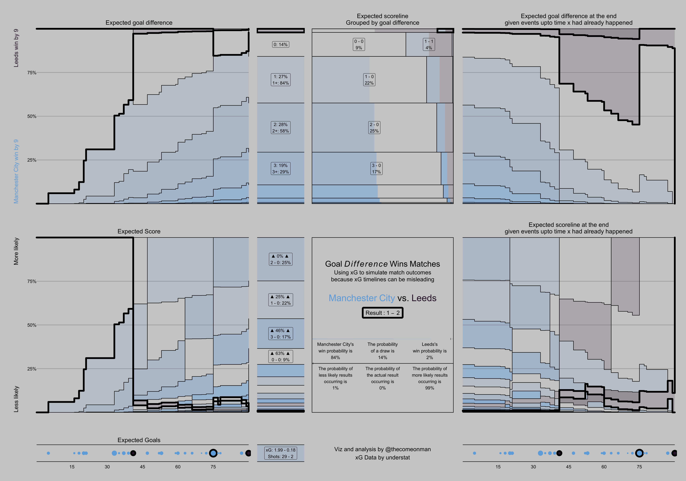

# Simulating Results Based on xG 

## Objective

Posting sums of xG over the game is a common practice on Twiiter. And it's wrong. Probabilities are weird and just summing them is over simplifying it.

I have put together an xG based inforgraphic of a game. This is created after simulating the sequence of shots and the xG of each many many times over, recording each shot as a goal or not based on the simulation, and doing aggregations and rolling sums of the simulated goals.

This is not meant to be an easy to digest, Twitter friendly, kind of viz. That's why I'm not calling it a viz. My objective is to get viewers to appreciate the nuance to using xG to predicting game results, and in general the nuance behind working with probabilities. xG totals and timelines is clearly terrific to get engagement on social media but you may not want to use it like that at your job. You don't recruit players based on their pass completion percentage either, do you? 

## Explaining the Infographic

There are three rows - two big, one small. There are four columns - big, small, medium, big. The fourth column is a stretch goal, it's an interesting thing to look at but not necessary very useful to begin with. If you find that column confusing, just skip it to begin with.

Here is what is happening in each of the plots:
- Row 1, column 1: The probabilities of various goal difference values at any point in time during the game, based on the shots upto that point. The probability bands are vertically sorted in order of goal difference such that the highest goal difference towards Manchester City winning is always at the bottom and the highest goal difference towards Leeds winning is always at the top. The band with the dark outline tracks the band for the actual eventual goal difference.
- 1,2: More information about the probability distribution of various goal difference values at the end of the game after all the shots have been taken.
- 1,3: Spltting each goal difference value further into the probabilities of the individual scorelines which could lead to the goal difference.
- 1,4: The probabilities of various goal difference values possible at the end of the game, based the actual events during the game until time x, and simulating the remaining events after x.
- 2,1: Similar to 1,1 except each probability band is a particular score and the vertical sorting is such that the lowest probability score line is at the bottom, and the highest probabilty scoreline is at the top.
- 2,2: Similar to 1,2 except each probability band is a particular score and the vertical sorting is such that the lowest probability score line is at the bottom, and the highest probabilty scoreline is at the top.
- 2,3: Summary of the simulations
- 2,4: Similar to 1,4 except each probability band is a particular score and the vertical sorting is such that the lowest probability score line is at the bottom, and the highest probabilty scoreline is at the top.
- 3,1: Each shot and the xG of each shot along the duration of the game
- 3,2: The overall sum of xG and count of shots, which is not enough information about the game. This is kept here for the viewer to appreciate all the information that this is not able to capture.
- 3,4: Each shot and the xG of each shot along the duration of the game

## Other Interesting Things This Infographic Tells You

Some other interesting observations beyond what is mentioned in the summary in the infographic already:
- By the time Leeds scored their first goal, Manchester City were ahead by at least one goal in around 60% of the simulations. You can see this in 1,1.
- City were more likely to win 1-0, 2-0, or 3-0 than any drawn scoreline.  You can see this in 2,2.
- The final 1-2 scoreline was pretty unlikely but after Leeds scored their first goal it became possible, albeit still quite unlikely. After City's goal, the remaining shots in the rest of the game gave both teams an almost equal chance of winning by a goal, with around a 75% probability of the game ending in a draw.  You can see this in 1,4 and 2,4.
- Before City scored their goal, Leeds had more than a 50% chance of winning by one goal based on the shots that were to happen after that. Most of this probability came from the possibility of a 0-1 win.  You can see this in 1,4.
- City's first goal came at a point where the probability of them winning by at least one goal was barely 10%. All their shot attempts after that goal were only enough to increase their chance of winning to a little under 20%.  You can see this in 1,4.

## Get in Touch

If you found it too intimidating and the above description didn't help enough, or for compliments, or requests, please reply .